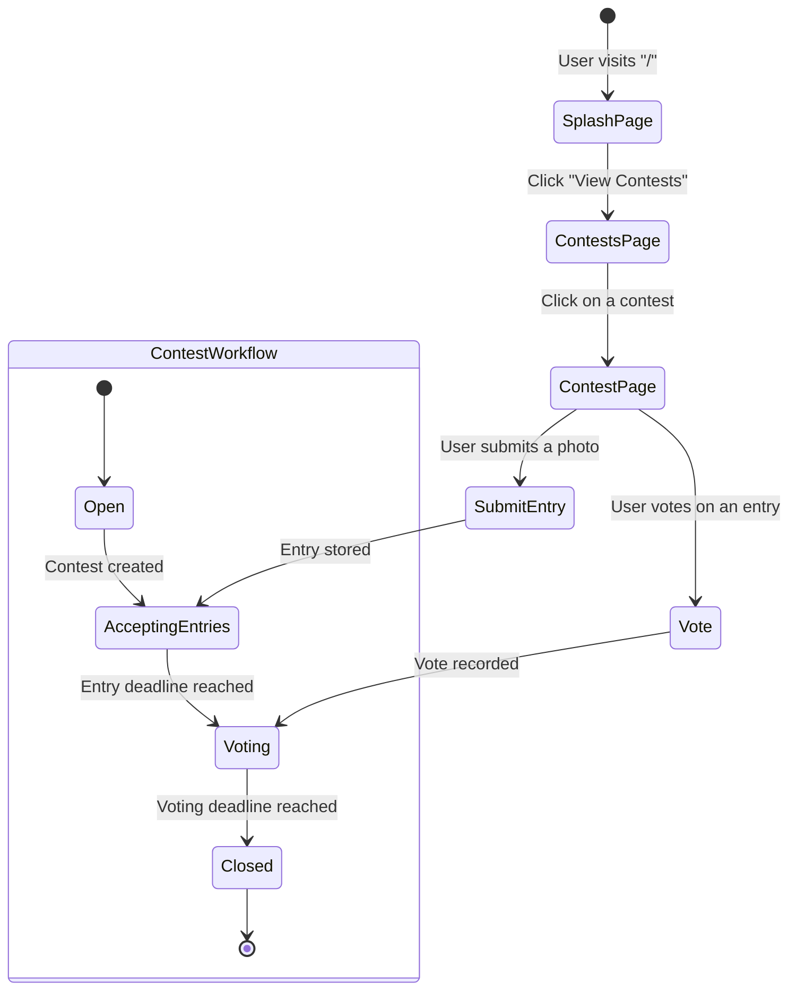

# Welcome to React Router!

A modern, production-ready template for building full-stack React applications using React Router.

## Features

- 🚀 Server-side rendering
- ⚡️ Hot Module Replacement (HMR)
- 📦 Asset bundling and optimization
- 🔄 Data loading and mutations
- 🔒 TypeScript by default
- 🎉 TailwindCSS for styling
- 📖 [React Router docs](https://reactrouter.com/)

## Getting Started

### Installation

Install the dependencies:

```bash
npm install
```

### Development

Start the development server with HMR:

```bash
npm run dev
```

Your application will be available at `http://localhost:5173`.

## Previewing the Production Build

Preview the production build locally:

```bash
npm run preview
```

## Building for Production

Create a production build:

```bash
npm run build
```

## Deployment

Deployment is done using the Wrangler CLI.

To build and deploy directly to production:

```sh
npm run deploy
```

To deploy a preview URL:

```sh
npx wrangler versions upload
```

You can then promote a version to production after verification or roll it out progressively.

```sh
npx wrangler versions deploy
```

## Styling

This template comes with [Tailwind CSS](https://tailwindcss.com/) already configured for a simple default starting experience. You can use whatever CSS framework you prefer.



---

Built with ❤️ using React Router.
