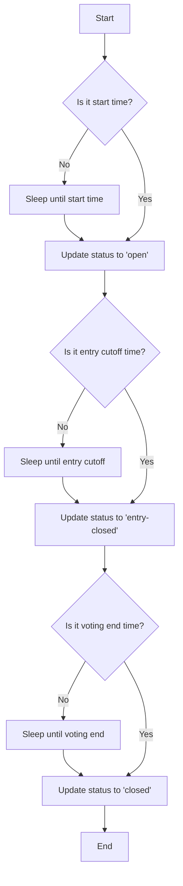

# 🕰️ Temporal Worker Package

This package creates a Temporal worker and provides a tRPC server that proxies requests to the Temporal server. This setup is necessary because Cloudflare Workers can't directly use the Temporal TypeScript SDK.

## ✨ Features

- Temporal worker setup
- tRPC server for proxying requests to Temporal
- Contest lifecycle workflow management

## 🔄 Temporal Workflow

This package utilizes Temporal for managing the contest lifecycle. Here are the key Temporal features used:

1. **Workflows**: The main contest lifecycle is implemented as a Temporal workflow in `contestLifecycle.ts`.
2. **Activities**: The workflow uses activities to update the contest status.
3. **Sleep**: Temporal's `sleep` function is used to manage the timing between different phases of the contest.
4. **Logging**: Temporal's built-in logging is used for tracking the workflow progress.
5. **Error Handling**: ApplicationFailure is used to handle and report errors during the workflow execution.

### Contest Lifecycle Workflow Diagram



## 🛠️ Setup and Running the Server

1. Set up the environment variables:

   Copy the `.env.sample` file to `.env` and set the `TW_INTERNAL_SECRET`:

   ```
   cp .env.sample .env
   ```

   Then edit the `.env` file and set a secure value for `TW_INTERNAL_SECRET`. This secret is used to authenticate internal routes on the application Hono server for accessing the D1 database.

2. Install dependencies:

   ```
   pnpm install
   ```

3. Start the development server:

   ```
   pnpm run dev
   ```

The server will start running on `http://localhost:3000` by default. You can configure a different port by setting the `PORT` environment variable in your `.env` file.

Make sure to keep your `.env` file secure and never commit it to version control. The `TW_INTERNAL_SECRET` should be a strong, unique value for each environment (development, staging, production).

## 🔌 Connecting to the tRPC Server

To connect to the tRPC server from your client application:

1. Install the necessary dependencies in your client project:

```shell
pnpm install @trpc/client @trpc/server
```

2. Create a tRPC client in your application:

```typescript
import { createTRPCProxyClient, httpBatchLink } from "@trpc/client";
import type { AppRouter } from "@snapoff/temporal-worker/src/routes/_app";

export const trpcClient = createTRPCProxyClient<AppRouter>({
  links: [
    httpBatchLink({
      url: "http://localhost:3000/trpc"
    })
  ]
});
```

3. Use the client to make requests:

   ```typescript
   const result = await trpcClient.startContestLifecycle.mutate({
     contestId: "your-contest-uuid",
     startTime: new Date(),
     entryCutoffTime: new Date(Date.now() + 86400000), // 24 hours from now
     votingEndTime: new Date(Date.now() + 172800000) // 48 hours from now
   });

   console.log("Started workflow:", result.workflowId);
   ```

Make sure to replace `"http://localhost:3000/trpc"` with the appropriate URL if your server is running on a different host or port.

## 🚀 tRPC Functions

The tRPC server exposes the following function:

### 🏁 `startContestLifecycle`

Starts a new contest lifecycle workflow.

Input:

- `contestId`: string (UUID of the contest)
- `startTime`: Date (Start time of the contest)
- `entryCutoffTime`: Date (Time when entries are no longer accepted)
- `votingEndTime`: Date (Time when voting ends)

Returns:

- `workflowId`: string (ID of the started workflow)
